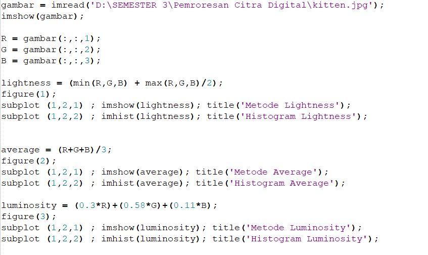
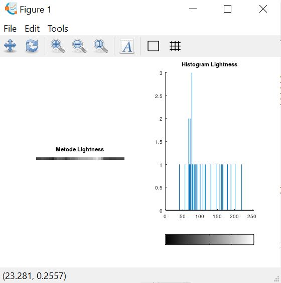
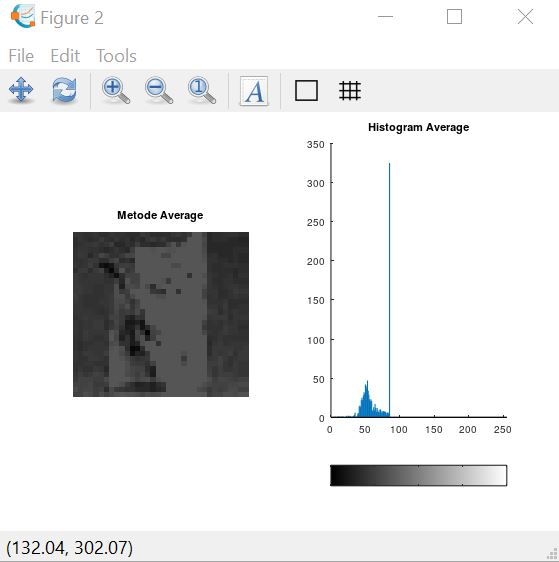
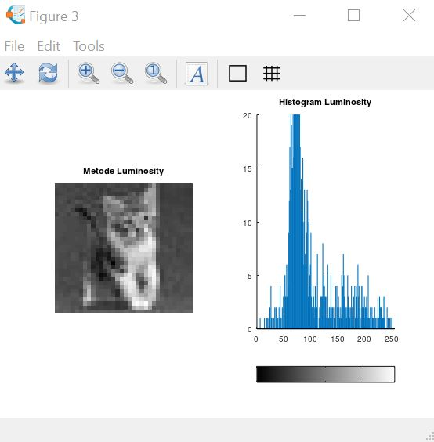

### Nama : ALFIKA NURFADIA
### NIM : 2110131220016
---
# Tiga Metode Algoritma Mengubah Nilai R G B Menjadi Grayscale

Berdasarkan catatan dokumentasi GIMP, dapat kita telusuri bahwa terdapat tiga macam metode algoritma untuk mengubah nilai R G B menjadi Grayscale.

1. Lightness  
    Algoritmanya adalah mencari nilai tertinggi dan terendah dari nilai R G B, kemudian nilai tertinggi dan terendah tersebut dijumlahkan lantas dikalikan dengan 0.5. Secara matematis dapat dirumuskan :  
    **Grayscale = (max(R,G,B)) + (min(R,G,B)) * 0.5**

2. Average  
    Algoritmanya adalah dengan menjumlahkan seluruh nilai R G B, kemudian dibagi 3, sehingga diperoleh nilai rata-rata dari R G B, nilai rata-rata itulah yang dapat dikatakan sebagai grayclase. Rumus matematisnya adalah :  
    **Grayscale = (R + G + B) / 3**

3. Luminosity  
    Algoritmanya adalah dengan mengalikan setiap nilai R G B dengan konstanta tertentu yang sudah ditetapkan nilainya, kemudian hasil perkalian seluruh nilai R G B dijumlahkan satu sama lain. Rumus matematisnya adalah :  
    **Grayscale = (0.21 * R) + (0.72 * G) + (0.07 * B)**

## Berikut Cara Implementasinya Menggunakan MATLAB

1. Lightness Method
    

1. Average Method
    

1. Luminosity Method
    

