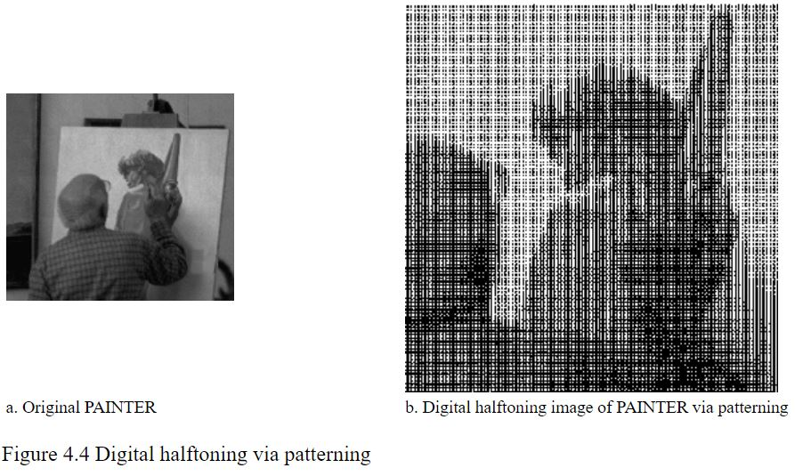

### Nama : ALFIKA NURFADIA
### NIM : 2110131220016
---
# Halftoning

Halftoning atau halftoning analog adalah proses yang mensimulasikan nuansa abu-abu dengan memvariasikan ukuran titik-titik hitam kecil yang diatur dalam pola yang teratur. Teknik ini digunakan dalam printer, serta industri penerbitan. Jika Anda memeriksa sebuah foto di koran, Anda akan melihat bahwa gambar itu terdiri dari titik-titik hitam meskipun tampaknya terdiri dari abu-abu. Hal ini dimungkinkan karena integrasi spasial yang dilakukan oleh mata kita. Mata kita memadukan detail halus dan merekam intensitas keseluruhan [1]. Halftoning digital mirip dengan halftoning di mana gambar didekomposisi menjadi kotak sel halftone. Elemen (atau titik yang digunakan halftoning dalam mensimulasikan nuansa abu-abu) dari sebuah gambar disimulasikan dengan mengisi sel halftone yang sesuai. Semakin banyak jumlah titik hitam dalam sel halftone, semakin gelap sel tersebut. Misalnya, pada Gambar 4, sebuah titik kecil yang terletak di tengah disimulasikan dalam halftoning digital dengan mengisi sel halftone tengah; demikian juga, titik ukuran sedang yang terletak di sudut kiri atas disimulasikan dengan mengisi empat sel di sudut kiri atas. Titik besar yang menutupi sebagian besar area pada gambar ketiga disimulasikan dengan mengisi semua sel halftone.

# Patterning

Pola adalah yang paling sederhana dari tiga teknik untuk menghasilkan gambar halftoning digital. Ini menghasilkan gambar yang memiliki resolusi spasial lebih tinggi daripada gambar sumber. Jumlah sel halftone citra keluaran sama dengan jumlah piksel citra sumber. Namun, setiap sel halftone dibagi lagi menjadi kotak 4x4. Setiap nilai piksel input diwakili oleh jumlah kotak terisi yang berbeda dalam sel halftone. Karena kisi 4x4 hanya dapat mewakili 17 tingkat intensitas yang berbeda, gambar sumber harus dikuantisasi. Gambar 4.2 menunjukkan matriks pola rekursif Rylander, yang akan digunakan dalam daftar 4.1, dan contoh operasi pola.

NAMA

pattern - menghasilkan gambar halftoning digital dari gambar input melalui pola.

RINGKASAN

pola(nama_file_input, nama_file_output)

KETERANGAN

pattern menghasilkan gambar halftoning digital dari gambar input menggunakan teknik pola. Pola program membaca gambar input, mengkuantisasi nilai piksel, dan memetakan setiap piksel ke pola yang sesuai. Gambar yang dihasilkan 16 kali lebih besar dari aslinya. Gambar yang dihasilkan ditulis ke file output sebagai file TIFF. Sebuah kata peringatan: "pola" membutuhkan banyak perhitungan, gambar berukuran kurang dari 100x100 direkomendasikan.

CONTOH

pola('PAINTER.TIF', 'pa_ptr.tif')

Contoh ini menghasilkan gambar halftoning digital dari PAINTER menggunakan teknik pola (Gambar 4.4)

# Dithering

Teknik lain yang digunakan untuk menghasilkan gambar halftoning digital adalah dithering. Tidak seperti pola, dithering membuat gambar keluaran dengan jumlah titik yang sama dengan jumlah piksel pada gambar sumber. Dithering dapat dianggap sebagai thresholding gambar sumber dengan matriks gentar. Matriks diletakkan berulang kali di atas gambar sumber. Dimanapun nilai piksel gambar lebih besar dari nilai dalam matriks, titik pada gambar output diisi. Masalah dithering yang terkenal adalah menghasilkan artefak pola yang diperkenalkan oleh matriks ambang batas tetap. Gambar 4.5 menunjukkan contoh operasi dithering.

NAMA

dither - menghasilkan gambar halftone digital melalui dithering

RINGKASAN

dither (nama_file_input, nama_file_output)

dither (nama_file_input, nama_file_output, dmatrix)

KETERANGAN

Sinopsis pertama menggunakan matriks gentar default untuk ambang batas gambar input. Kekhawatiran default adalah

Matriks ini adalah matriks gentar persegi panjang yang diekstraksi dari matriks gentar 450. 450 matriks gentar dapat membuat artefak kurang jelas. Sinopsis kedua, di sisi lain, menggunakan matriks gentar yang ditentukan oleh pengguna. gentar membaca dalam gambar input, membandingkan setiap piksel dengan elemen yang sesuai dalam matriks gentar, menghasilkan gambar output, dan menulisnya ke file output, yang dalam format TIFF. Sebuah kata peringatan: karena "gentar" membutuhkan banyak perhitungan, gambar berukuran kurang dari 100x100 direkomendasikan.

CONTOH

dither('LENA.TIF', 'di_le.tif')

Contoh ini menghasilkan gambar halftone digital dari LENA menggunakan matriks gentar default (Gambar 4.5a.)

dither('S_PAINTER.TIF', 'di_spa.tif', [105,135,30;90,67.5,120;45,15,45;])

Contoh ini menghasilkan gambar halftone digital dari PAINTER menggunakan matriks gentar yang ditentukan oleh pengguna (Gambar 4.5b.)

