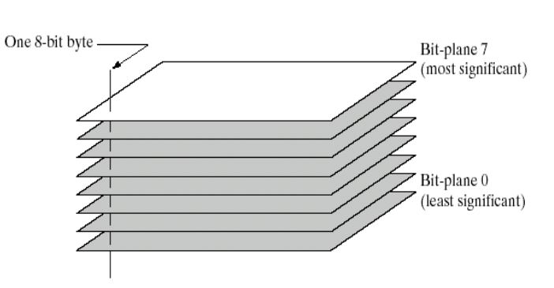
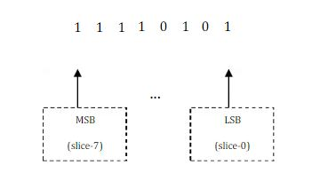
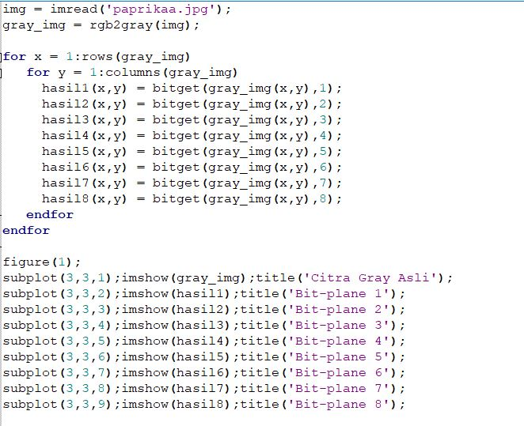
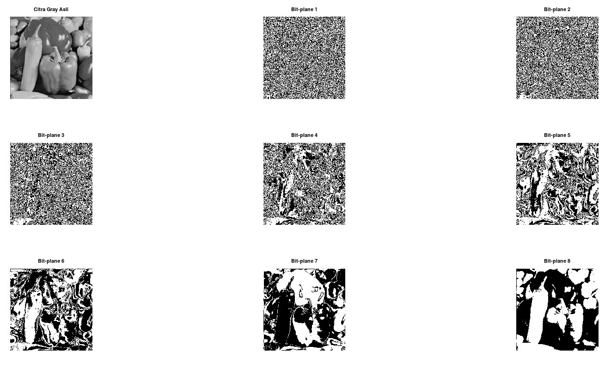

### Nama : ALFIKA NURFADIA
### NIM : 2110131220016
---
# Bit-Plane Slicing & Steganography
## Bit-Plane Slicing
Bit-Plane Slicing merupakan metode yang digunakan untuk melihat kontribusi atau pengaruh dari setiap bit penyusun citra. Untuk citra 8 bit, pada dasarnya tiap intesitas yang nilainya dalam format desimal, bisa dipecah menjadi bit-bit dalam format biner.

Misalnya, senuah piksel dengan intensitas 245 (desimal) dan dijadikan biner adalah 11110101. Denganb nilai LSB ( Least Significant Bit) berada di paling kanan, dan sebaliknya untuk MSB (Most Significant Bit). Pada gambar dibawah yang merupakan ilustrasi dari bit slicing pada piksel citra.

 

 

### Cara Implementasi Bit-Plane Slicing Menggunakan OCTAVE

- Code pada octave 

  

- Foto awal dan dibuat gray Scale

 

- Hasil Bit-Plane Slicing

 

## Steganography

