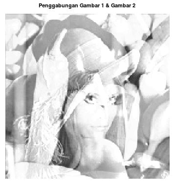
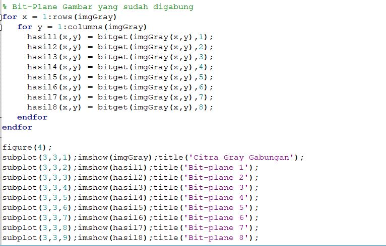
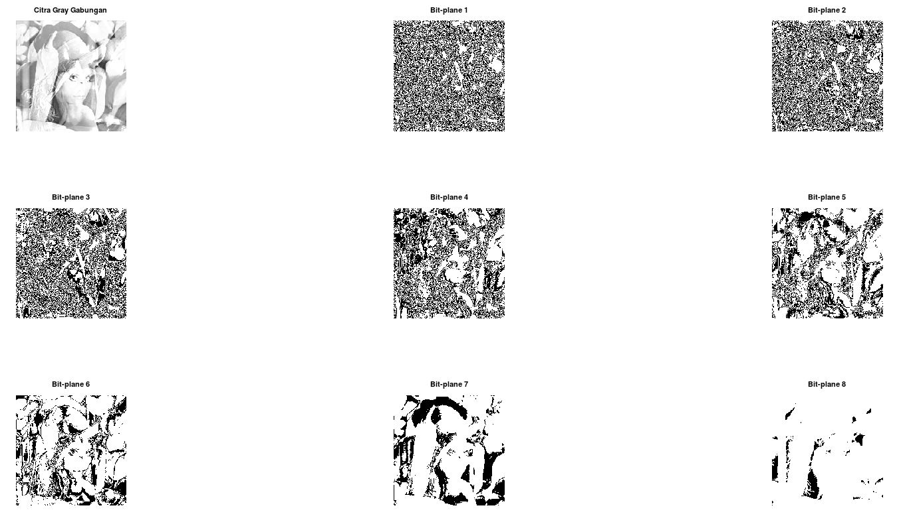
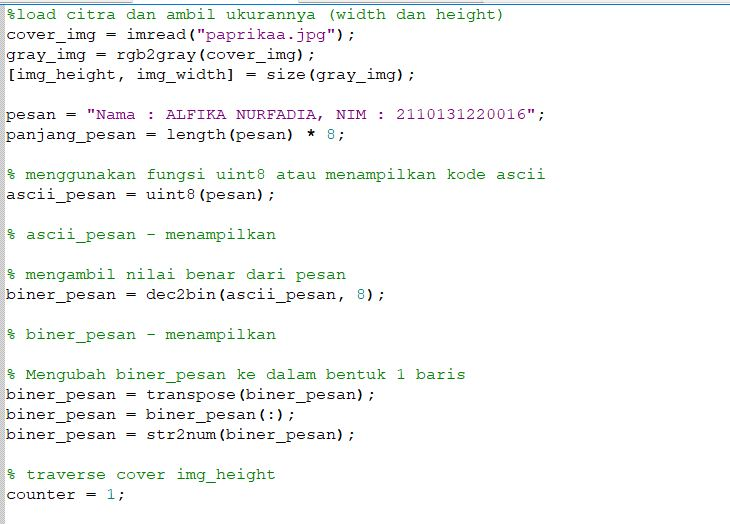
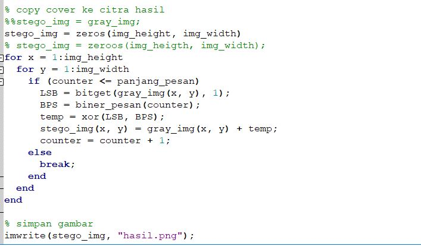
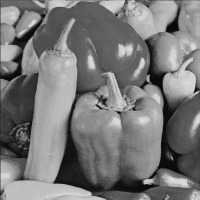

### Nama : ALFIKA NURFADIA
### NIM : 2110131220016
---
# Bit-Plane Slicing & Steganography
## Bit-Plane Slicing
Bit-Plane Slicing merupakan metode yang digunakan untuk melihat kontribusi atau pengaruh dari setiap bit penyusun citra. Untuk citra 8 bit, pada dasarnya tiap intesitas yang nilainya dalam format desimal, bisa dipecah menjadi bit-bit dalam format biner.

Misalnya, senuah piksel dengan intensitas 245 (desimal) dan dijadikan biner adalah 11110101. Denganb nilai LSB ( Least Significant Bit) berada di paling kanan, dan sebaliknya untuk MSB (Most Significant Bit). Pada gambar dibawah yang merupakan ilustrasi dari bit slicing pada piksel citra.

 

 

### Cara Implementasi Bit-Plane Slicing Menggunakan OCTAVE

- Code pada octave untuk Bit-Plane Slicing

  

- Foto awal dan dibuat gray Scale

 

- Hasil Bit-Plane Slicing

 

### Menggabungkan 2 Gambar lalu di Bit-Plane Slicing 
- Code pada octave untuk menggabungkan gambar

 

- Gambar yang digabungkan

 Gambar 1

 Gambar 2
 

- Hasil gambar yang digabungkan

 

- Code pada octave untuk Bit-Plane Slicing foto yang telah digabungkan

 

- Hasil Bit-Plane Slicing dari gambar yang digabung

 

---

## Steganography

Steganografi adalah seni dan ilmu menulis pesan tersembunyi atau menyembunyikan pesan dengan suatu cara sehingga selain si pengirim dan si penerima, tidak ada seorang pun yang mengetahui atau menyadari bahwa ada suatu pesan rahasia.

Tujuan dari steganografi adalah merahasiakan atau menyembunyikan keberadaan dari sebuah pesan atau sebuah informasi penting. Dalam praktiknya, kebanyakan pesan disembunyikan dengan membuat perubahan tipis terhadap data digital lain yang isinya tidak akan menarik perhatian dari penyerang potensial, sebagai contoh sebuah gambar yang terlihat tidak berbahaya. Perubahan ini bergantung pada kunci (sama pada kriptografi) dan pesan untuk disembunyikan. Orang yang menerima gambar kemudian dapat menyimpulkan informasi terselubung dengan cara mengganti kunci yang benar ke dalam algoritma yang digunakan.

### Cara Implementasi Steganography Menggunakan OCTAVE

- Code pada octave untuk membuat steganography

 

- Gambar awal

 

- Setelah di Steganography

 

Setelah di steganorafi, gambar tidak ada terjadi  perubahan karena text diletakkan di lapisan paling bawah atau Least Significant Bit(LSB) sehingga tidak terlalu signifikan atau berpengaruh.
Untuk melihat gambarnya telah ada text, bisa di cek lagi, apabila ada text maka pixelnya akan berubah warna menjadi putih, seperti dibawah ini

 

