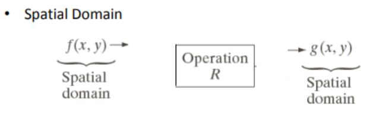
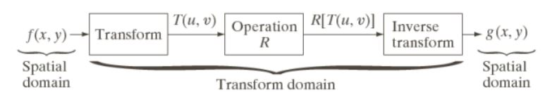

### Nama : ALFIKA NURFADIA
### NIM : 2110131220016
---
# Metode Spasial dan frekuensi Domain
Berdasarkan ranah (domain) operasinya, metode-metode untuk memperbaiki kualitas citra dapat dikelompokkan menjadi dua yaitu image enhancement dalam ranah spasial dan image enhancement dalam ranah frekuensil.

## image Enhancement dalam Ranah Spasial

Metode-metode image enhancement dalam ranah spasial dilakukan dengan memanipulasi secara langsung pixel-pixel di dalam citra.
    

 

## Image Enhancement dalam ranah Frekuensi

Metode-metode image enhancement dalam ranah frekuensi dilakukan dengan mengubah citra terlebih dahulu dari ranah spasial ke ranah frekuensi, baru kemudian memanipulasi nilai-nilai frekuens tersebut.

Masing-masing ranah operasi digunakan untuk tujuan yang spesifik, karena **tidak semua perbaikan citra dapat dilakukan dalam ranah spasial** begitu juga sebaliknya.   
    

 

